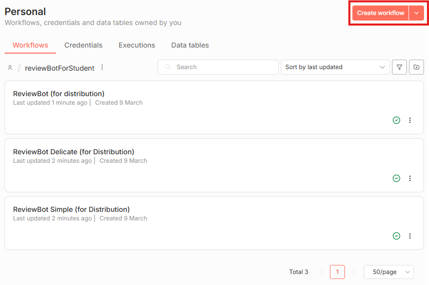
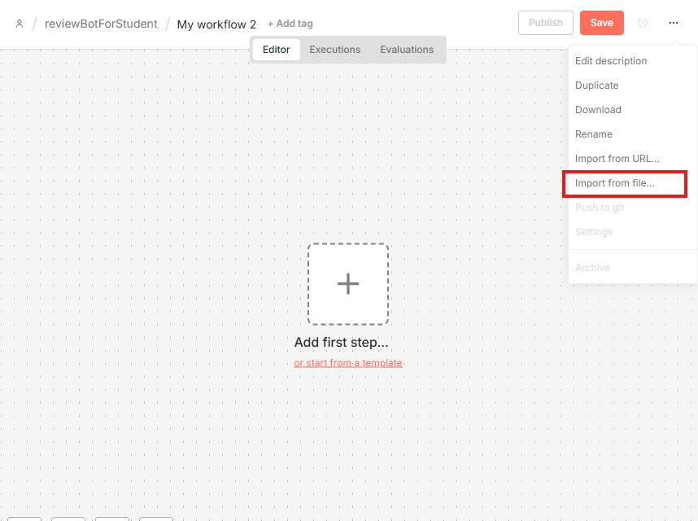
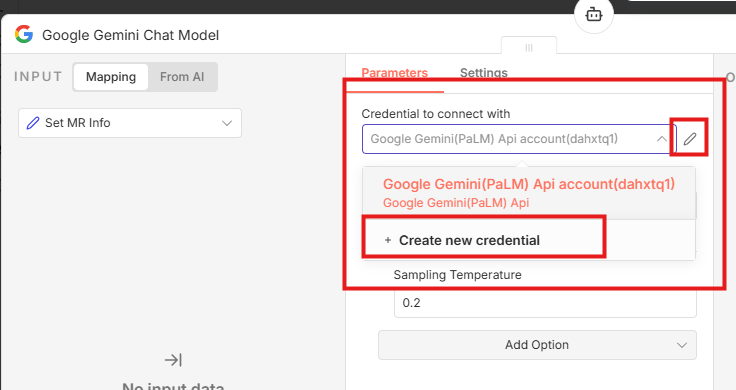

# [코치세션] 코딩만 하기에도 바쁜 우리 팀을 위한 n8n 자동화 가이드

#### 26.03.26(목) / 14기 이혜원 실습코치 진행

n8n GitLab 자동화 Workflow 가이드 자료입니다.
GitLab MR 알림, AI 코드 리뷰, Jenkins 빌드 알림을 자동화하는 n8n 워크플로우를 제공합니다.

<a href="https://youtu.be/C5MM-1e39L0?si=v3vMjA5zPKT23yX2" target="_blank">
<h2> 싸피티비 코치세션 유튜브 🔗</h2>

</a>

> ※ 이미지를 클릭하면 유튜브 사이트로 이동합니다.

---

## 📦 디렉토리 구조

```
src/
├── a-mr-noti/
│   └── MRAlert.json                  # A: GitLab MR 알림
├── b-mr-review-bot/
│   ├── ReviewBot.json                # B: ReviewBot 메인 컨트롤러
│   ├── ReviewBot Simple.json         # B: ReviewBot 서브 - 전체 리뷰
│   └── ReviewBot Delicate.json       # B: ReviewBot 서브 - 상세 리뷰
└── c-jenkins-noti/
    └── JenkinsAlert.json             # C: Jenkins 빌드 알림 + AI 에러 예측
```

---

## 🗂️ 워크플로우 소개

### A. GitLab MR 알림 (`a-mr-noti/`)

GitLab MR 이벤트를 감지해 Mattermost 채널에 알림을 전송합니다.

| 파일           | 역할                        | 작동 조건                                |
| -------------- | --------------------------- | ---------------------------------------- |
| `MRAlert.json` | MR 이벤트 → Mattermost 알림 | MR 오픈/재오픈, 리뷰 명령어 댓글 작성 시 |

**MR 댓글 명령어**

- `/리뷰완료` : 리뷰어 → MR 작성자에게 확인 요청 알림
- `/리뷰다시` : 작성자 → 리뷰어에게 재검토 요청 알림

---

### B. ReviewBot AI 코드 리뷰 (`b-mr-review-bot/`)

GitLab MR을 AI가 자동으로 분석하고 코드 리뷰 코멘트를 달아주는 봇입니다.
하나의 메인 워크플로우와 두 개의 서브 워크플로우로 구성됩니다.

| 파일                      | 워크플로우 이름 (import 후)           | 역할                          | 작동 조건                                 |
| ------------------------- | ------------------------------------- | ----------------------------- | ----------------------------------------- |
| `ReviewBot.json`          | **B: ReviewBot 메인 컨트롤러**        | 메인 컨트롤러 (Webhook 감지)  | MR 생성/재오픈, 특정 댓글 작성 시         |
| `ReviewBot Simple.json`   | **B: ReviewBot Simple (전체 리뷰)**   | 전체 리뷰 (요약 및 전체 흐름) | MR 오픈 시 또는 `리뷰봇전체` 댓글 작성 시 |
| `ReviewBot Delicate.json` | **B: ReviewBot Delicate (상세 리뷰)** | 상세 리뷰 (라인별 집중 분석)  | 코드 라인에 `리뷰봇이것만` 댓글 작성 시   |

**MR 댓글 명령어**

- `리뷰봇전체` : MR 전체 변경사항에 대한 AI 코드 리뷰 요청
- `리뷰봇이것만` : 특정 코드 라인(DiffNote)에 달면 해당 파일만 상세 리뷰

---

### C. Jenkins 빌드 알림 + AI 에러 예측 (`c-jenkins-noti/`)

Jenkins 빌드 결과를 Mattermost에 알리고, 실패 시 AI가 에러 원인을 분석합니다.

| 파일                | 역할                          | 작동 조건                       |
| ------------------- | ----------------------------- | ------------------------------- |
| `JenkinsAlert.json` | 빌드 결과 알림 + AI 에러 분석 | Jenkins 빌드 완료(성공/실패) 시 |

---

## 🛠️ 사전 준비 사항

워크플로우별로 필요한 Credential이 다릅니다. 사용할 워크플로우에 맞게 준비하세요.

| Credential                                           | 필요한 워크플로우 | 발급 방법                                                      |
| ---------------------------------------------------- | ----------------- | -------------------------------------------------------------- |
| **GitLab API** (Personal Access Token, `api` 스코프) | A, B, C           | GitLab → 우측 상단 프로필 → Edit Profile → Access Tokens       |
| **Google Gemini(PaLM) API**                          | B, C              | [Google AI Studio](https://aistudio.google.com/) → Get API Key |
| **Mattermost Incoming Webhook URL**                  | A, B, C           | Mattermost → 채널 메뉴 → Integrations → Incoming Webhooks      |
| **Redis**                                            | B (선택)          | 팀 Redis 서버 접속 정보 (없으면 Redis Chat Memory 노드 제거)   |

---

## 📥 워크플로우 Import

##### (1) n8n에서 새로운 워크플로우 생성



##### (2) JSON 파일 Import



##### (3) Credential 등록 및 연결

워크플로우를 열면 Credential이 필요한 노드에 경고가 표시됩니다.
각 노드를 클릭하여 미리 등록한 Credential을 선택하거나 새로 생성합니다.

예시:



##### (4) B 사용 시: 서브 워크플로우 연결

**B: ReviewBot Simple (전체 리뷰)** 와 **B: ReviewBot Delicate (상세 리뷰)** 를 먼저 import한 뒤, **B: ReviewBot 메인 컨트롤러** 를 import합니다.

메인 워크플로우의 `Call Simple ReviewBot`, `Call Delicate ReviewBot` 노드에서
각각의 서브 워크플로우를 재선택해야 합니다. (import 후 ID가 바뀌기 때문)

##### (5) B 사용 시: 브랜치 필터링 설정

`Filter Deployment` 노드(Code 노드) 내 `excludedBranches` 리스트를 팀 컨벤션에 맞게 수정합니다.

```js
// 기본값 — 해당 브랜치로의 MR은 리뷰봇이 작동하지 않음
const excludedBranches = ["master", "release"];
```

##### (6) GitLab Webhook 등록

각 워크플로우의 Webhook 노드를 활성화한 뒤, 표시되는 URL을 복사합니다.

GitLab 프로젝트 → Settings → Webhooks에서 URL 등록:

| 워크플로우      | Trigger 체크 항목                         |
| --------------- | ----------------------------------------- |
| A: MR 알림      | Merge request events, Comments            |
| B: ReviewBot    | Merge request events, Comments            |
| C: Jenkins 알림 | Jenkins Notification Plugin에서 직접 설정 |

---

## 🔗 문의

궁금한 점은 14기 이혜원 실습코치에게 Mattermost로 연락해주세요.

---

> 작성자: 14기 이혜원 실습코치 (Mattermost DM)
> 작성일: 26.03.27
